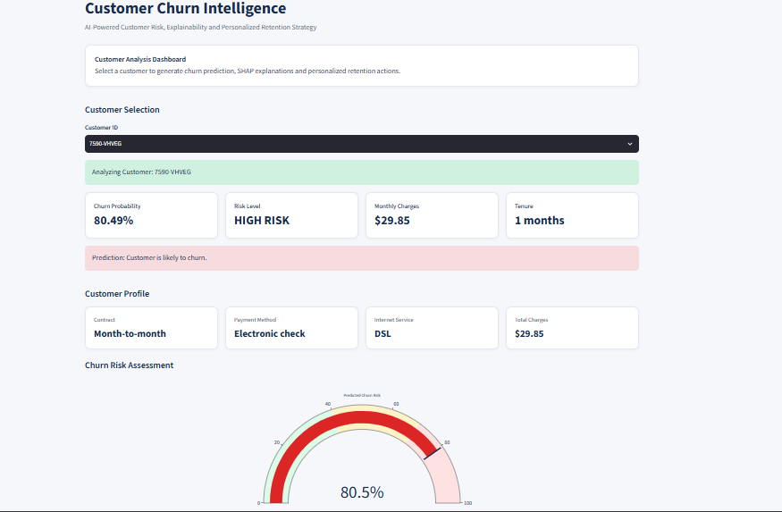
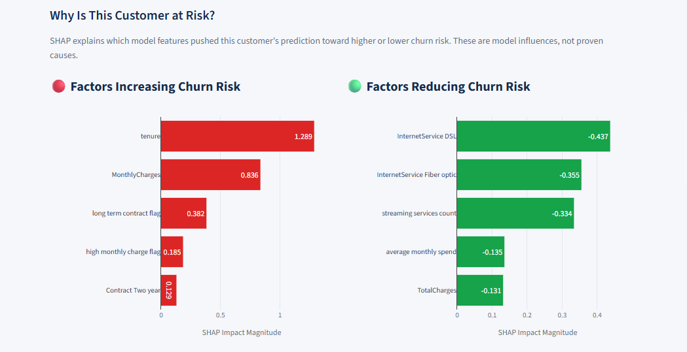
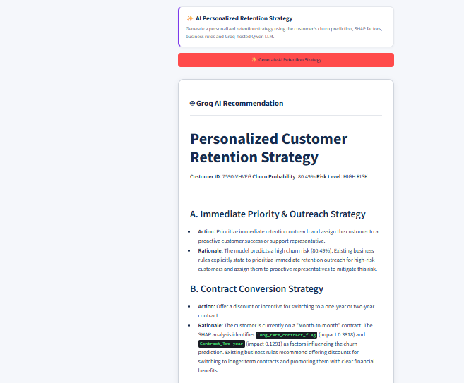
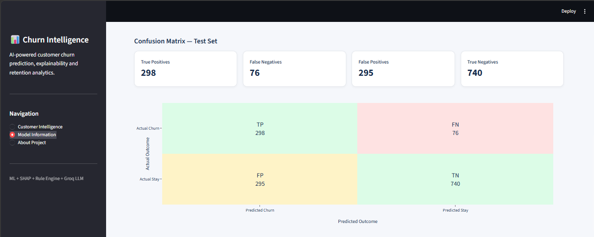
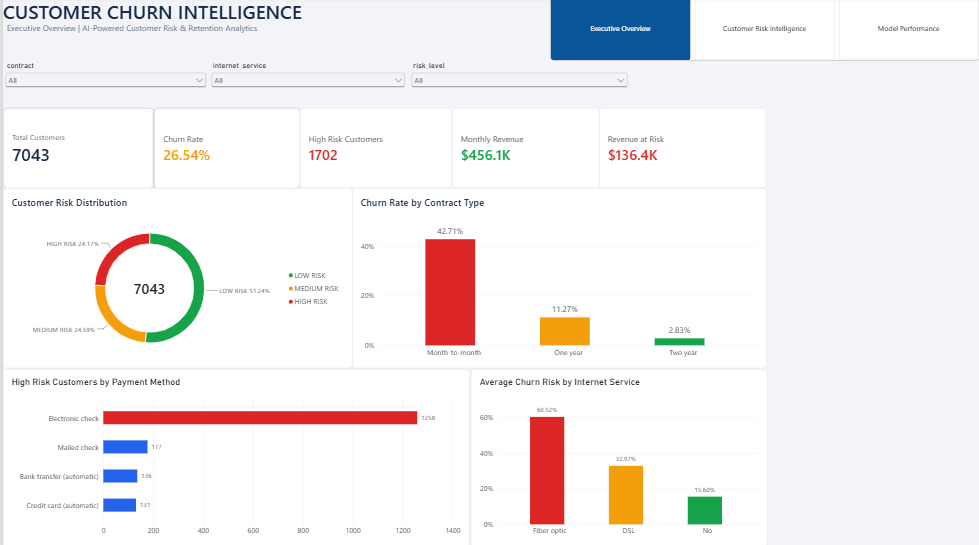
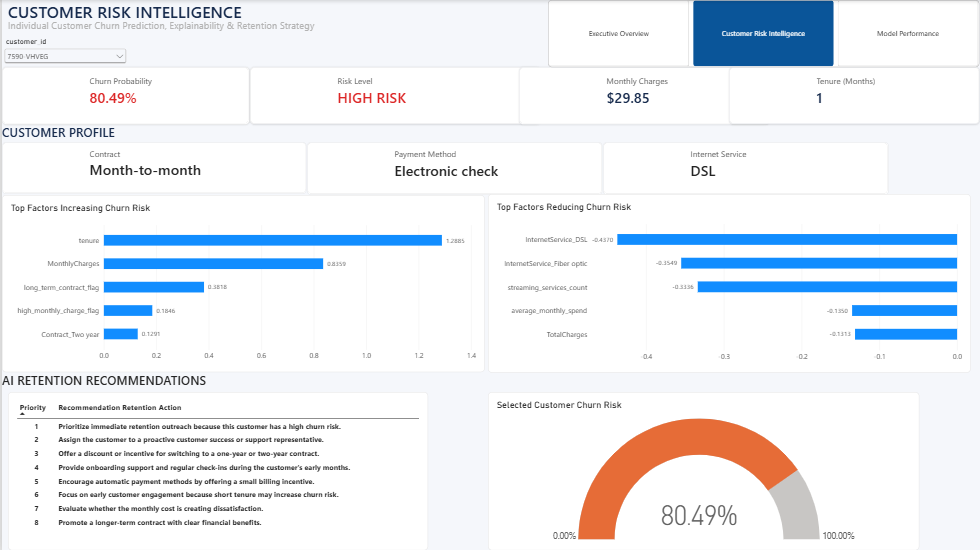
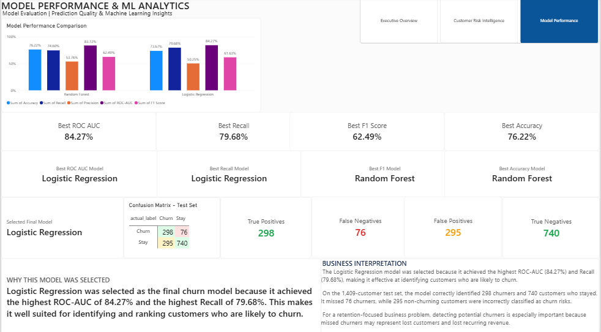

# AI-Powered Customer Churn Intelligence System

An end-to-end **Customer Churn Intelligence and Retention Analytics System** that combines Machine Learning, Explainable AI, SQL Analytics, Power BI, Generative AI, and Streamlit.

The system does more than simply predict whether a customer is likely to churn. It also explains **why the model considers the customer at risk** and generates **actionable personalized retention strategies**.

## 🌐 Live Demo

🔗 **Streamlit App:** [Open Live Customer Churn Intelligence System](https://customer-churn-intelligence-meopu6r8uwjn7hr5jrnrfq.streamlit.app/)

🔗 **GitHub Repository:** [View Source Code](https://github.com/KhushShah15/customer-churn-intelligence)

# 🖥️ Project Screenshots

## Streamlit — Customer Intelligence



---

## SHAP Explainability



---

## Groq AI Personalized Retention Strategy



---

## Streamlit — Model Performance



---

# 📊 Power BI Dashboard

## Executive Overview



---

## Customer Risk Intelligence



---

## Model Performance



---

---

## 📌 Project Overview

Customer churn is a major business problem for subscription-based companies because losing existing customers directly affects recurring revenue and customer lifetime value.

This project builds an intelligent churn-management system capable of answering three important business questions:

1. **Which customers are likely to churn?**
2. **Why is a particular customer considered at risk?**
3. **What actions should the business take to retain that customer?**

The solution combines predictive machine learning, SHAP explainability, business-rule recommendations, Generative AI, SQL analytics, Power BI dashboards, and an interactive Streamlit application.

---

## 🎯 Project Objectives

The main objectives of this project are to:

- Predict individual customer churn probability.
- Classify customers into LOW, MEDIUM, and HIGH risk.
- Identify the main factors influencing each prediction.
- Explain model behavior using SHAP.
- Generate deterministic rule-based retention actions.
- Generate personalized retention strategies using Generative AI.
- Perform customer and churn analysis using SQL.
- Build an interactive Power BI dashboard.
- Build an interactive Streamlit web application.
- Present results in a business-friendly and explainable manner.

---

# 🚀 Key Features

- Customer-level churn probability prediction
- LOW, MEDIUM, and HIGH churn-risk classification
- Machine Learning model comparison
- Customer-level SHAP explainability
- Top factors increasing churn risk
- Top factors reducing churn risk
- Rule-based retention recommendation engine
- Groq-powered Generative AI retention strategies
- SQL-based customer analytics
- SQLite database integration
- Interactive Power BI dashboard
- Interactive Streamlit web application
- Customer-specific churn-risk gauge
- Model evaluation metrics
- Confusion matrix analysis
- Business-focused interpretation
- Secure API-key handling using environment variables

---

# 📊 Dataset

The project uses the **IBM Telco Customer Churn Dataset**.

### Dataset Summary

- **Total Customers:** 7,043
- **Original Features:** 21
- **Target Variable:** `Churn`
- **Actual Churn Rate:** 26.54%
- **Churned Customers:** 1,869
- **Non-Churned Customers:** 5,174

The dataset contains customer information related to:

- Demographics
- Account tenure
- Contract type
- Internet service
- Payment method
- Monthly charges
- Total charges
- Support services
- Streaming services
- Churn status

---

# 🧹 Data Preprocessing

The preprocessing stage includes:

- Loading the raw customer dataset
- Checking missing values
- Correcting data types
- Converting `TotalCharges` to numeric format
- Handling blank `TotalCharges` values
- Encoding the churn target

Target transformation:

```text
Yes → 1
No  → 0
```

The cleaned dataset is stored at:

```text
data/processed/cleaned_customer_data.csv
```

---

# 🔍 Exploratory Data Analysis

Exploratory Data Analysis was performed to identify important churn patterns.

### Key Findings

- Overall churn rate: **26.54%**
- Month-to-month contract churn rate: **42.71%**
- Electronic check churn rate: **45.29%**
- Fiber optic churn rate: **41.89%**

EDA visualizations include:

- Churn distribution
- Churn by contract type
- Churn by internet service
- Churn by payment method
- Tenure distribution
- Monthly charges vs churn

Generated figures are stored in:

```text
reports/figures/
```

---

# 🛠️ Feature Engineering

Additional features were created to improve customer segmentation and churn analysis.

Engineered features include:

- `tenure_group`
- `average_monthly_spend`
- `high_monthly_charge_flag`
- `long_term_contract_flag`
- `auto_payment_flag`
- `support_services_count`
- `streaming_services_count`
- `customer_value_segment`

The feature-engineered dataset contains **29 columns** and is stored at:

```text
data/processed/featured_customer_data.csv
```

---

# 🤖 Machine Learning

Two classification models were trained and evaluated:

1. **Logistic Regression**
2. **Random Forest**

The dataset was split into:

- **80% Training Data**
- **20% Test Data**

A stratified split was used to preserve the churn distribution.

The preprocessing pipeline includes:

### Numerical Features

- Median imputation
- Standard scaling

### Categorical Features

- Most-frequent imputation
- One-hot encoding

---

# 📈 Model Performance

| Model | Accuracy | Precision | Recall | F1 Score | ROC-AUC |
|---|---:|---:|---:|---:|---:|
| Logistic Regression | 73.67% | 50.25% | 79.68% | 61.63% | 84.27% |
| Random Forest | 76.22% | 53.76% | 74.60% | 62.49% | 83.72% |

---

# 🏆 Selected Final Model

## Logistic Regression

Logistic Regression was selected as the final churn prediction model because it achieved the highest:

- **ROC-AUC: 84.27%**
- **Recall: 79.68%**

Although Random Forest achieved slightly better Accuracy and F1 Score, Logistic Regression was selected because identifying actual churners is especially important for customer-retention problems.

High Recall helps reduce the number of churners that the model fails to identify.

The trained model is stored at:

```text
models/best_churn_model.joblib
```

---

# 🧪 Test-Set Confusion Matrix

The final Logistic Regression model was evaluated on **1,409 test customers**.

| Actual / Predicted | Predicted Churn | Predicted Stay |
|---|---:|---:|
| Actual Churn | 298 | 76 |
| Actual Stay | 295 | 740 |

### Confusion Matrix Results

- **True Positives:** 298
- **False Negatives:** 76
- **False Positives:** 295
- **True Negatives:** 740

### Business Interpretation

The model correctly identified:

- 298 customers who actually churned
- 740 customers who stayed

The model missed:

- 76 actual churners

The model also incorrectly flagged:

- 295 non-churning customers as churn risks

For a customer-retention use case, Recall is important because missing a potential churner can result in lost customers and recurring revenue.

---

# 🎯 Customer Risk Classification

Customers are classified according to predicted churn probability.

```text
LOW RISK     → Probability below 40%

MEDIUM RISK  → Probability from 40% to below 70%

HIGH RISK    → Probability 70% or higher
```

This allows retention teams to prioritize high-risk customers.

---

# 🔎 Explainable AI with SHAP

SHAP is used to explain individual customer churn predictions.

For every customer, the system identifies:

- Top factors increasing predicted churn risk
- Top factors reducing predicted churn risk
- SHAP impact values

Example risk factors may include:

- Tenure
- Monthly Charges
- Contract type
- Internet Service
- Total Charges
- Payment Method
- Support services

### Important Interpretation

SHAP values represent **model influence**, not proven causal relationships.

A positive SHAP value indicates that a feature pushed the model toward a higher churn prediction.

A negative SHAP value indicates that a feature pushed the model toward a lower churn prediction.

SHAP explanations for all customers are exported to:

```text
reports/powerbi/customer_shap_explanations.csv
```

---

# 💡 Rule-Based Retention Recommendation Engine

The project includes a deterministic rule-based retention recommendation engine.

Recommendations are generated using:

- Churn probability
- Risk level
- Contract type
- Customer tenure
- Monthly charges
- Payment method
- SHAP risk factors

Example recommendations include:

- Prioritize immediate retention outreach.
- Assign a proactive customer-success representative.
- Offer incentives for switching to a longer-term contract.
- Provide onboarding support.
- Encourage automatic payment methods.
- Review monthly cost sensitivity.
- Promote long-term contract benefits.

The recommendations are exported to:

```text
reports/powerbi/customer_recommendations.csv
```

---

# ✨ Generative AI Integration

The project also includes a real Generative AI layer using:

- **Groq API**
- **Qwen LLM**

The LLM receives:

```text
Customer Profile
        +
Churn Probability
        +
Risk Level
        +
Top SHAP Risk Factors
        +
Rule-Based Recommendations
        ↓
Groq + Qwen
        ↓
Personalized Retention Strategy
```

The Generative AI layer produces customer-specific information such as:

- Risk Summary
- Key Risk Drivers
- Recommended Retention Actions
- Offer Strategy
- Communication Approach
- Priority Level

---

# 🛡️ Grounded Generative AI

The LLM prompt is designed to reduce unsupported assumptions.

The model is instructed to use only:

- Customer information supplied by the dataset
- Machine Learning prediction
- SHAP factors
- Rule-based recommendations

The LLM is instructed not to invent unsupported facts such as:

- Customer complaints
- Competitor activity
- Usage decline
- Financial difficulties
- Customer dissatisfaction
- Support history
- Customer preferences

If sufficient evidence is unavailable, the system avoids making unsupported claims.

---

# 🔄 Hybrid Recommendation Architecture

The project uses two recommendation layers:

```text
Rule-Based Recommendation Engine
              +
       Groq Generative AI
              ↓
Personalized Retention Intelligence
```

The deterministic rule-based system provides stable business logic.

The LLM converts those insights into a more personalized and business-friendly retention strategy.

The rule-based layer also provides a fallback if the external LLM service is unavailable.

---

# 🗄️ SQL & Database Analytics

SQLite is used for structured customer analytics.

The project database contains tables such as:

```text
customers

customer_predictions

customer_explanations

retention_recommendations

model_performance
```

The database contains all **7,043 customers**.

SQL analytics include:

- Total customers
- Churned customers
- Churn rate
- Monthly revenue
- Risk-level distribution
- Average churn probability
- Revenue at risk
- Top high-risk customers

### SQL Results

```text
Total Customers: 7,043

Churned Customers: 1,869

Churn Rate: 26.54%

Monthly Revenue: $456,116.60

High-Risk Customers: 1,702

High-Risk Average Probability: 82.10%

Revenue at Risk: $136,402.20
```

---

# 📊 Power BI Dashboard

A professional Power BI dashboard was created for business analysis.

The report contains three main pages.

---

## 1️⃣ Executive Overview

The Executive Overview provides organization-level churn insights.

### KPI Cards

- Total Customers
- Churn Rate
- High-Risk Customers
- Monthly Revenue
- Revenue at Risk

### Visualizations

- Customer Risk Distribution
- Churn Rate by Contract Type
- High-Risk Customers by Payment Method
- Average Churn Risk by Internet Service

---

## 2️⃣ Customer Risk Intelligence

The Customer Risk Intelligence page provides customer-level analysis.

Features include:

- Customer ID selector
- Churn probability
- Risk level
- Monthly charges
- Tenure
- Contract
- Payment Method
- Internet Service
- Customer churn-risk gauge
- SHAP factors increasing risk
- SHAP factors reducing risk
- Retention recommendations

---

## 3️⃣ Model Performance

The Model Performance page provides Machine Learning evaluation.

Features include:

- Logistic Regression vs Random Forest comparison
- Best ROC-AUC
- Best Recall
- Best F1 Score
- Best Accuracy
- Selected final model
- Confusion matrix
- True Positives
- False Negatives
- False Positives
- True Negatives
- Business interpretation

---

# 🌐 Streamlit Web Application

The final application is built using **Streamlit**.

The application contains three main pages.

---

## 1️⃣ Customer Intelligence

The Customer Intelligence page allows the user to select any customer from the dataset.

It provides:

- Real customer selection
- ML churn probability
- Risk classification
- Monthly charges
- Tenure
- Customer profile
- Contract information
- Payment method
- Internet service
- Total charges
- Churn-risk gauge
- SHAP factors increasing churn risk
- SHAP factors reducing churn risk
- Rule-based retention recommendations
- Groq AI personalized retention strategy

---

## 2️⃣ Model Information

The Model Information page provides:

- Best ROC-AUC
- Best Recall
- Best F1 Score
- Best Accuracy
- Final model selection
- Logistic Regression vs Random Forest comparison
- Confusion Matrix
- True Positives
- False Negatives
- False Positives
- True Negatives
- Business Interpretation

---

## 3️⃣ About Project

The About Project page explains:

- Project overview
- Business problem
- End-to-end workflow
- Technology stack
- Model performance
- System capabilities
- Explainable AI
- Responsible AI
- Skills demonstrated

---

# 🏗️ System Architecture

```text
                 RAW CUSTOMER DATA
                        |
                        v
                DATA PREPROCESSING
                        |
                        v
                FEATURE ENGINEERING
                        |
                        v
             EXPLORATORY DATA ANALYSIS
                        |
                        v
                MACHINE LEARNING
                        |
                        v
              LOGISTIC REGRESSION
                        |
                        v
               CHURN PROBABILITY
                        |
                        v
                  RISK LEVEL
                        |
                        v
                SHAP EXPLANATION
                        |
                        v
            RULE-BASED RETENTION ENGINE
                        |
                        v
                 GROQ + QWEN LLM
                        |
                        v
          PERSONALIZED RETENTION STRATEGY
                        |
             -----------------------
             |                     |
             v                     v
          POWER BI             STREAMLIT
```

---

# 🧰 Technology Stack

## Data Analysis

- Python
- Pandas
- NumPy

## Machine Learning

- Scikit-learn
- Logistic Regression
- Random Forest
- Joblib

## Explainable AI

- SHAP

## Database

- SQLite
- SQL
- SQLAlchemy

## Data Visualization

- Power BI
- Plotly
- Matplotlib

## Generative AI

- Groq API
- Qwen LLM
- Prompt Engineering

## Application Development

- Streamlit
- Python-dotenv

## Development Environment

- Visual Studio Code
- Python Virtual Environment

---

# 📁 Project Structure

```text
customer-churn-intelligence/
│
├── app/
│   └── streamlit_app.py
│
├── data/
│   ├── raw/
│   │   └── Telco-Customer-Churn.csv
│   │
│   └── processed/
│       ├── cleaned_customer_data.csv
│       └── featured_customer_data.csv
│
├── database/
│   └── churn_database.db
│
├── models/
│   └── best_churn_model.joblib
│
├── notebooks/
│
├── reports/
│   │
│   ├── figures/
│   │
│   ├── model_results/
│   │   └── model_comparison.csv
│   │
│   └── powerbi/
│       ├── customer_churn_dashboard.csv
│       ├── customer_shap_explanations.csv
│       ├── customer_recommendations.csv
│       └── model_test_predictions.csv
│
├── sql/
│
├── src/
│   ├── __init__.py
│   ├── ai_recommendations.py
│   ├── batch_predict.py
│   ├── churn_intelligence.py
│   ├── config.py
│   ├── create_database.py
│   ├── data_preprocessing.py
│   ├── eda.py
│   ├── export_model_evaluation_powerbi.py
│   ├── export_recommendations_powerbi.py
│   ├── export_shap_powerbi.py
│   ├── feature_engineering.py
│   ├── llm_recommendations.py
│   ├── load_data.py
│   ├── predict.py
│   ├── shap_explainer.py
│   ├── sql_analysis.py
│   └── train_model.py
│
├── .env
├── .gitignore
├── README.md
├── main.py
└── requirements.txt
```

---

# ⚙️ Installation

## 1. Clone the Repository

```bash
git clone <your-repository-url>
```

Move into the project folder:

```bash
cd customer-churn-intelligence
```

---

## 2. Create a Virtual Environment

```bash
python -m venv venv
```

### Activate on Windows

```bash
venv\Scripts\activate
```

### Activate on macOS/Linux

```bash
source venv/bin/activate
```

---

## 3. Install Dependencies

```bash
pip install -r requirements.txt
```

---

# 🔐 Environment Variables

Create a file named:

```text
.env
```

inside the project root.

Add:

```env
GROQ_API_KEY=your_groq_api_key_here
GROQ_MODEL=qwen/qwen3.6-27b
```

Replace:

```text
your_groq_api_key_here
```

with your own Groq API key.

### Important

Never upload your real `.env` file to GitHub.

Your `.gitignore` should include:

```gitignore
.env
venv/
.venv/
__pycache__/
*.pyc
database/*.db
.streamlit/secrets.toml
```

---

# ▶️ Run the Streamlit Application

From the project root, run:

```bash
streamlit run app/streamlit_app.py
```

The application should open at:

```text
http://localhost:8501
```

---

# 🧠 Run Customer Intelligence from Terminal

You can also run the customer-intelligence pipeline directly:

```bash
python -m src.churn_intelligence
```

Enter a Customer ID when prompted.

Example:

```text
7590-VHVEG
```

---

# 👤 Example Customer Output

Example customer:

```text
Customer ID: 7590-VHVEG

Churn Probability: 80.49%

Risk Level: HIGH RISK

Prediction: Likely to Churn

Contract: Month-to-month

Tenure: 1 month

Monthly Charges: $29.85

Payment Method: Electronic check

Internet Service: DSL
```

The system then generates:

- SHAP risk explanations
- Rule-based retention recommendations
- Groq AI personalized retention strategy

---

# 📉 Batch Prediction Results

Predictions were generated for all **7,043 customers**.

### Risk Distribution

| Risk Level | Customers | Percentage |
|---|---:|---:|
| Low Risk | 3,609 | 51.24% |
| Medium Risk | 1,732 | 24.59% |
| High Risk | 1,702 | 24.17% |

Average raw predicted churn probability:

```text
41.32%
```

Because class balancing was used during model training, this raw average probability should not be interpreted as the expected future churn rate without probability calibration.

---

# 💰 Revenue at Risk

The project also estimates the monthly revenue represented by high-risk customers.

```text
Total Monthly Revenue:
$456,116.60

Monthly Revenue at Risk:
$136,402.20
```

This helps translate Machine Learning predictions into business impact.

---

# ⚖️ Responsible AI

The project separates four different forms of intelligence:

```text
Machine Learning Prediction
          ↓
SHAP Model Explanation
          ↓
Rule-Based Business Recommendation
          ↓
Generative AI Strategy
```

These layers are intentionally kept separate.

### Important Principles

- Predictions are probabilistic, not guaranteed outcomes.
- SHAP values represent model influence, not causation.
- Rule-based recommendations are deterministic.
- Generative AI recommendations are advisory.
- The LLM is instructed not to invent unsupported customer information.
- Human review should be used before real-world retention decisions.

---

# 🔒 Security

The Groq API key is stored securely using environment variables.

The API key is never hard-coded into Python files.

The following file must remain private:

```text
.env
```

It is excluded from Git using:

```gitignore
.env
```

---

# 💼 Skills Demonstrated

This project demonstrates practical experience with:

- Data Analysis
- Data Cleaning
- Exploratory Data Analysis
- Feature Engineering
- SQL
- SQLite
- Machine Learning
- Classification
- Logistic Regression
- Random Forest
- Model Evaluation
- Precision
- Recall
- F1 Score
- ROC-AUC
- Confusion Matrix
- Explainable AI
- SHAP
- Power BI
- Business Intelligence
- Business Storytelling
- Generative AI
- LLM Integration
- Groq API
- Prompt Engineering
- Streamlit
- Plotly
- Python Application Development

---

# 🔮 Future Improvements

Possible future enhancements include:

- Probability calibration
- Cross-validation
- Hyperparameter optimization
- Gradient boosting models
- Additional churn algorithms
- Model monitoring
- Automated retraining pipelines
- Retention-offer optimization
- Customer feedback tracking
- Recommendation effectiveness analysis
- Authentication
- Role-based access control
- Cloud database integration
- Production API deployment
- Docker containerization
- CI/CD pipeline
- Real-time customer data integration
- Automated retention campaign triggering

---

# 📌 Key Business Value

The project demonstrates how Machine Learning can be extended beyond a simple prediction model.

Instead of only answering:

> **“Will this customer churn?”**

the system also answers:

> **“Why does the model believe this customer is at risk?”**

and:

> **“What should the business do about it?”**

This transforms a churn prediction model into a complete **Customer Retention Intelligence System**.

---

# ✅ Project Status

### Completed

- Data preprocessing ✅
- Exploratory Data Analysis ✅
- Feature Engineering ✅
- Machine Learning ✅
- Model Comparison ✅
- Churn Prediction ✅
- Customer Risk Segmentation ✅
- SHAP Explainability ✅
- Rule-Based Recommendations ✅
- SQLite Database ✅
- SQL Analytics ✅
- Batch Predictions ✅
- Power BI Dashboard ✅
- Groq API Integration ✅
- Qwen LLM Integration ✅
- Streamlit Application ✅
- Model Performance Dashboard ✅
- Responsible AI Guardrails ✅

---

# 🏁 Conclusion

The **AI-Powered Customer Churn Intelligence System** demonstrates how predictive analytics can be extended beyond a traditional classification model into a complete customer-retention decision-support solution.

The Machine Learning layer identifies customers who are likely to churn.

SHAP explains which features influenced each prediction.

The rule-based recommendation engine converts predictive insights into deterministic business actions.

Groq-hosted Qwen Generative AI transforms customer information, model predictions, SHAP explanations, and business rules into personalized retention strategies.

SQL and Power BI provide business-level analytics, while Streamlit brings all of the intelligence together in an interactive application.

The final solution demonstrates the practical integration of:

**Data Analytics + Machine Learning + Explainable AI + Business Intelligence + Generative AI + Application Development**

into one end-to-end portfolio project.